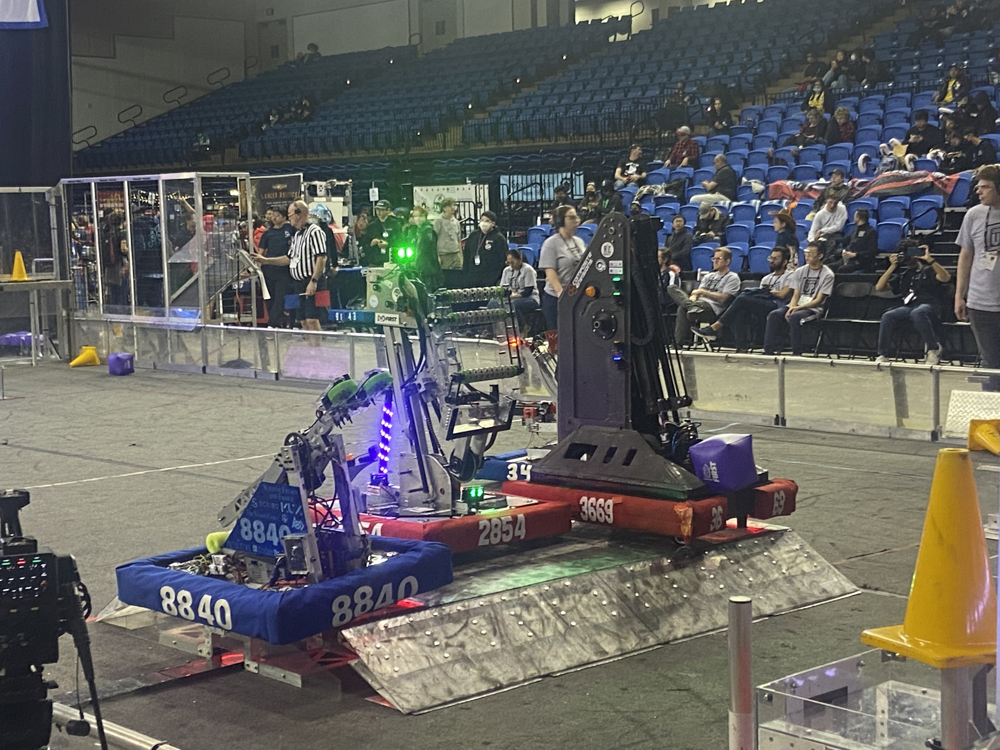
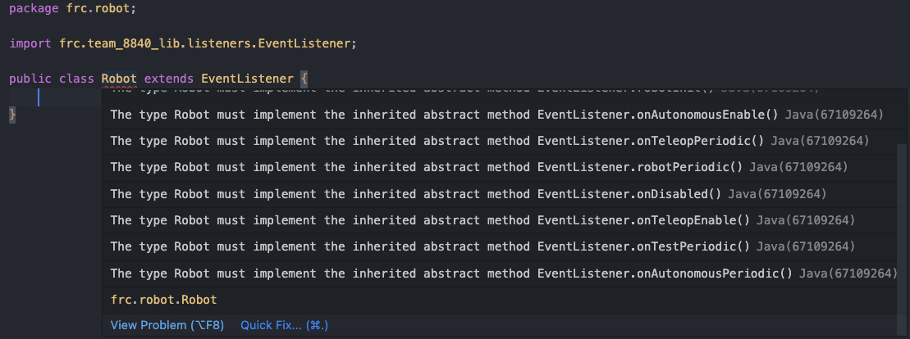
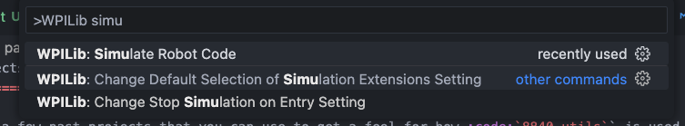
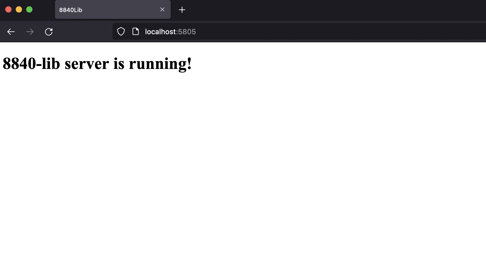

Example Project
===============

.. _example-project:

Overview
--------

In this example project, we'll go over the basics such as making a speed controller move and more, 
eventually progressing until we have a fully functional robot. This is an example project based on
Team 8840's 2023 robot, **Brad**.

*Say hello to Brad! Image from Silicon Valley Regional, Practice Match.*

Brad has a few things on him - a (swerve) drive base, a double jointed arm, and a roller claw.
We'll start our way from the easiest, the roller claw, and work our way up (or should I say down) to the drive base.

Prerequisites
-------------
- A basic understanding of Java
- A basic understanding of FRC

If you have not installed `8840-utils` yet, go through :ref:`this guide<installation>`.

Getting Setup
-------------
In VSCode, open up your :code:`Main.java` file. You should see something like this:

.. code-block:: java
    :linenos:

     package frc.robot;

     import edu.wpi.first.wpilibj.RobotBase;

     public final class Main {
         private Main() {}

         public static void main(String... args) {
             RobotBase.startRobot(Robot::new);
         }
     }

This is the entry point of your robot code. The :code:`main` method is called when the robot is turned on.

Before, we let it start working with 8840-utils, we need an *event listener.* 
An event listener is a class that will "listen" to events, such as when the robot is turned on, 
when the robot is disabled, when the robot is enabled, etc.

In 8840-utils, we have a class called :code:`EventListener` that does just that. Delete the `Robot.java` file, then create a new file called `Robot.java`.

It should look like this to start off:

.. code-block:: java
    :linenos:

     package frc.robot;

     public class Robot {
        
     }

First, we need to make it extend `EventListener`. To do that, we need to add `extends EventListener` to the class declaration.

.. code-block:: java
    :linenos:

     package frc.robot;

     import frc.team_8840_lib.listeners.EventListener;

     public class Robot extends EventListener {
        
     }

.. tip::
    We recommend using autofill in VSCode to import classes. As you type the name of the class, it will show up in a dropdown. 
    Press enter to autofill the import statement, and use the arrow keys to select the class you want to import.

A bunch of errors should pop up now... and that's ok! That's built into 8840-utils in order to make sure that you don't forget to implement any methods.
We'll fix this now. In VSCode, hover over the :code:`Robot` for a second until a menu underneath pops up. 
Move your mouse on top of that menu and scroll down until you see :code:`Quick fix...`. Click on that.

A bunch of methods should pop up. These are the methods that we need to implement. Save the class.
We recommend going through each one and deleting the :code:`throw` that's in each one, so you don't accidentally have an error later on.

Now, we need this linked to the robot. Go back to :code:`Main.java`.

We need to replace 

.. code-block:: java

    RobotBase.startRobot(Robot::new);

with

.. code-block:: java

    RobotBase.startRobot(frc.team_8840_lib.listeners.Robot::new);

instead! This will make sure that the robot is linked to 8840-utils.

We now need to let 8840-utils know that we're using the :code:`Robot` class we made before. Before the :code:`startRobot`, add this line

.. code-block:: java

    frc.team_8840_lib.listeners.Robot.assignListener(new Robot());

This will let 8840-utils know that we're using the :code:`Robot` class we made before.

We'll go back to the :code:`Robot` class now. We'll start by confirming everything works.

In the :code:`robotInit` method, we'll use the :code:`Logger` class to print out a message to the console.

Now, why use this instead of :code:`System.out.println`? Well, the :code:`Logger` class is a lot more powerful than :code:`System.out.println`.
Insted of just printing to the console, it adds a number of timestamps to make sure you know *exactly* when methods are called.
The message is also sent to a :code:`LogWriter`... but we'll get to that later, but it'll allow us to save everything to a file, then replay or analyze it later.

.. code-block:: java
    :linenos:

     // ...some code before
     @Override
     public void robotInit() {
         Logger.Log("Hello world!");
     }
     // some code after...

To test it, open up the WPILib menu from the top right and search for "simulate."

Click on the "Simulate Robot Code" button. Click OK on the popup that shows up, then let the program run.

.. image:: images/first\ test.png
    :alt: first test
    :align: center

You should see something like this in the console. If you do, then everything is working!

While we're here, let's also go over some of the other information:

First off, you'll notice that at the first message after :code:`Robot program starting`, it says that "...NT3 port 1735, NT4 port 5810".

NT stands for NetworkTables. NetworkTables is a way for the robot to communicate with the driver station. 
It's made by WPILib, and is used by programs such as Shuffleboard and SmartDashboard. 
It's a great way for the robot to send data to the driver station, and we'll be using this later on!

Now, below that, you might notice a line that states that the "Server is listening on port 5805." This is part of :code:`8840-utils`!

If we really want to confirm this working, open your web browser and go to :code:`http://localhost:5805/`.

You should see a message like so:

Interesting, right? This is primarly to communicate with :code:`8840-app`, our web app that allows you to do much more than just Shuffleboard, but we'll get to that later (again).

.. note::
    This layout looks different now, but just as long something appears is good.

The main difference between Network Tables and our server is that they're different ways of communicating.

Network Tables is a "websocket" - think of it as a phone call between the robot and the driver station.

Our server is a "REST API" - think of it as a text message, or writing emails between the robot and the driver station.

Generally, we'll be using Network Tables for things that need to be updated quickly, such as the robot's position, or the current speed of a motor.
We'll be using our server for things that don't need to be updated as quickly, such as the complete trajectory of autonomous, or the current state of the robot.
Our server also allows the driver station to tell us things such as which autonomous to choose - this could totally be done through NT, but we prefer to use our server for this.

It also allows those who want to make their own driver station to communicate with :code:`8840-utils` with simple HTTP requests, which is pretty cool!

A few more messages can be found, they're probably missing information though since you're not at a competition. 
You should notice a message that says "Hello world!" though - that's the message we sent from the :code:`robotInit` method!

Now, we're almost ready for the roller claw, we just need to create a few more things.

Containers
==========

.. note::
    This is where 8840-utils doesn't need to be used, this is generally how to set up a project.

We'll start by creating a new file, called :code:`RobotContainer.java`. This will be the main class that will hold all of our subsystems and commands.

First off, we'll add a :code:`static` instance of the class in order to access it from other classes, as well as make an instance when the container is created.

.. code-block:: java
    :linenos:

    // In RobotContainer.java

     private static RobotContainer instance;

     public static RobotContainer getInstance() {
         return instance;
     }

     public RobotContainer() {
        instance = this;
     }

Now, moving back to the :code:`Robot` class, we'll add a few more things.

.. code-block:: java
    :linenos:

     // In Robot.java

     private RobotContainer robotContainer;

     @Override
     public void robotInit() {
         // ...whatever was here before
 
         robotContainer = new RobotContainer();
     }

     @Override
     public void robotPeriodic() {
         CommandScheduler.getInstance().run();
     }

Perfect, now we have a container that we can use to store all of our subsystems and commands!

We'll now also create a file called :code:`Settings.java`. Here, we'll store all of our settings, such as motor ports, speeds, etc. This will make it easier to change things later on, but we'll add more to this later.

Import REV API
==============

.. note::
    We'll be using the REV API for this project. If you're using a different motor controller on your robot, this code will not be accurate to your robot.

We'll start by importing the REV API. This will allow us to use the motor controllers. In VSCode, in the WPILib menu, click on Manage Vendor Libraries.

Click on "Install new libraries (online)". This will open up a menu that will allow you to install libraries from the internet.

Paste in the following link:

.. code-block:: text

    https://software-metadata.revrobotics.com/REVLib-2023.json

Then run the build.

.. warning::
    This is only accurate for REV API v2023. If you're using a different version, you'll need to find the correct link.

Roller Claw
===========

We'll start of by making a new package (folder) called "subsystems". In that folder, we'll make a new file called :code:`Roller.java`.

Going back to :code:`Settings.java`, we'll first add in a few settings.

There are a few different constants that we'll use - the speeds of a fast intake, a slow outtake, and a fast outtake. We'll also add in the motor port.

We'll start of by making a new public class inside of :code:`Settings.java`, called :code:`Roller`.

There, we'll put these constants:

.. code-block:: java
    :linenos:

     public class Roller {
         public static final int ROLLER_MOTOR_ID = 30;
         public static final double FAST_OUTTAKE_SPEED = 0.7;
         public static final double SLOW_OUTTAKE_SPEED = 0.1;
         public static final double INTAKE_SPEED = -0.7;
     }
    

It's a few random values, but generally accurate to what the robot had. Feel free to change these values to whatever you want.

Now, we'll move back to :code:`Roller.java`. We'll start off by making it a subsystem.

.. code-block:: java
    :linenos:

     // In Roller.java

     public class Roller extends SubsystemBase {
            // ...
     }

We'll add in our Spark Max motor controller variable first.

.. code-block:: java
    :linenos:

     // In Roller.java

     private CANSparkMax rollerMotor;

Then, we'll need to initialize it in the constructor.

.. code-block:: java
    :linenos:

     // In Roller.java

     public Roller() {
         //Assumption of use of a NEO brushless motor
         rollerMotor = new CANSparkMax(Settings.Roller.ROLLER_MOTOR_ID, MotorType.kBrushless);
     }

We'll then add three methods - one for intaking, one for outtaking, and one for stopping. We'll also have outtaking take in a boolean, which will determine whether or not we want to outtake fast or slow.

.. code-block:: java
    :linenos:

     // In Roller.java

     public void intake() {
         rollerMotor.set(Settings.Roller.INTAKE_SPEED);
     }

     public void outtake(boolean fast) {
         if (fast) {
             rollerMotor.set(Settings.Roller.FAST_OUTTAKE_SPEED);
         } else {
             rollerMotor.set(Settings.Roller.SLOW_OUTTAKE_SPEED);
         }
     }

     public void stop() {
         rollerMotor.set(0);
     }

Almost there! The Spark Max controllers are pretty useful, and have plenty of features that we can play with.

Generally, the main things we'll want to set is the current limit, the ramp rate, and set the idle mode to break. We'll also want to tell it to slow down a bit on the CAN. 

We'll add this to the constructor.

.. code-block:: java
    :linenos:

     // In Roller.java

     public Roller() {
         //Assumption of use of a NEO brushless motor
         rollerMotor = new CANSparkMax(Settings.Roller.ROLLER_MOTOR_ID, MotorType.kBrushless);

         //Restore factory defaults
         rollerMotor.restoreFactoryDefaults();

         //Set the current limits
         rollerMotor.setSmartCurrentLimit(25);
         rollerMotor.setSecondaryCurrentLimit(30);

         //Set the ramp rate since it jumps to full speed too quickly - don't want to break the robot!
         rollerMotor.setOpenLoopRampRate(0.2);

         //Set the idle mode to brake
         rollerMotor.setIdleMode(IdleMode.kBrake);

         //Set the CAN timeout to 20ms
         rollerMotor.setCANTimeout(20);

         //Update the settings
         rollerMotor.burnFlash();
     }

We'll get to logging later, but for now we're done with the roller claw subsystem!

Intergrating Controls
=====================

We need to start off by making a folder called "commands," then creating a new file called "OperatorControl.java"

In this file, we'll make it extend "CommandBase," then add in a constructor, taking in a Roller. We'll store that in a private variable then use :code:`addRequirements` on it.

.. code-block:: java
    :linenos:

     // In OperatorControl.java

     public class OperatorControl extends CommandBase {
         private Roller roller;
        
         // Make sure the roller imported is the one from subsystems! Not from settings.
         public OperatorControl(Roller roller) {
             addRequirements(roller);
             this.roller = roller;
         }
     }

We then need to add in the :code:`execute` function of the command. This will be called every time the command is scheduled. Pretty much a loop!

.. code-block:: java
    :linenos:

     // In OperatorControl.java

     @Override
     public void execute() {
         // ...
     }

We'll add in another private varible with the type of PS4Controller, or XboxController. I'll be using PS4Controller for the operator, but if you're using a different one, you'll need to change it to that.

.. code-block:: java
    :linenos:

     // In OperatorControl.java

     private PS4Controller controller;

First, we'll add in the port of the controller. We'll add this line into settings:

.. code-block:: java
    :linenos:

     // In Settings.java

     public static final int OPERATOR_CONTROLLER_PORT = 1;

Then, we'll add in the controller in the constructor.

.. code-block:: java
    :linenos:

     // In OperatorControl.java

     public OperatorControl(Roller roller) {
         addRequirements(roller);
         this.roller = roller;
         controller = new PS4Controller(Settings.OPERATOR_CONTROLLER_PORT);
     }

Then, in :code:`execute`, we'll add in a few if statements. We'll change the speed of the roller claw based on the button pressed or released.

.. code-block:: java
    :linenos:

     @Override
     public void execute() {
         if (controller.getL2Button()) {
             roller.inttake();
         } else if (controller.getR2Button() || controller.getR1Button()) {
             roller.outtake(controller.getR2Button());
         } else {
             roller.stop();
         }
     }

Here, we're making it intake if the L2 button is down, if the R2 or R1 button is down, we'll outtake (if it's R2, it'll be fast), and if neither are down, we'll stop.

We're done with the command! Now, we need to add all of this to the robot container.

.. code-block:: java
    :linenos:

     // In RobotContainer.java

     private Roller roller;

     public RobotContainer() {
         // ...

         //Again, make sure that the right roller is imported!
         roller = new Roller();

         OperatorControl operatorControl = new OperatorControl(roller);

         roller.setDefaultCommand(
            operatorControl
         );

         // ...
     }

Perfect, our robot is now ready to intake and outtake balls!

The Arm
=======

The arm is a bit more complicated than the roller claw, but it's still pretty simple.

We'll start off by making a new file called "Arm.java" in the subsystems folder.

We'll start off by making it extend SubsystemBase, then adding in two private variables for the motor controllers called "baseMotor" and "elbowMotor".

.. code-block:: java
    :linenos:

     // In Arm.java

     public class Arm extends SubsystemBase {
         private CANSparkMax baseMotor;
         private CANSparkMax elbowMotor;
     }

We also need to add in two more private variables of type :code:`SparkMaxEncoderWrapper`, called "baseEncoder" and "elbowEncoder". These will be used to get the position of the arm.

.. code-block:: java
    :linenos:

     // In Arm.java

     private SparkMaxEncoderWrapper baseEncoder;
     private SparkMaxEncoderWrapper elbowEncoder;

Going back to Settings.java, we'll add in a few pieces of important settings for the arm motors.

.. code-block:: java
    :linenos:

     // In Settings.java

     public static class Arm {
         public static final int BASE_MOTOR_ID = 31;
         public static final int ELBOW_MOTOR_ID = 32;
 
         public static final double GEAR_RATIO = 192 / 1;
 
         public static final PIDStruct BASE_PID = new PIDStruct(0.010, 0.0, 0.0);
         public static final PIDStruct ELBOW_PID = new PIDStruct(0.010, 0.0, 0.0);
 
         public static final double MAX_BASE_SPEED = 0.8;
         public static final double MAX_ELBOW_SPEED = 0.8;
 
         public static final double CLOSED_LOOP_RAMP_RATE = 1.0;
     }

.. warning::
    These PID values were the ones that worked for our robot. 
    If you're using our robot, you may want to consider recalibrating them, same with the max speed and ramp rate.

In Arm.java, we need to setup the constructor.

.. code-block:: java
    :linenos:

    // In Arm.java

     public Arm() {
         baseMotor = new CANSparkMax(Settings.Arm.BASE_MOTOR_ID, MotorType.kBrushless);
         elbowMotor = new CANSparkMax(Settings.Arm.ELBOW_MOTOR_ID, MotorType.kBrushless);

         baseEncoder = new SparkMaxEncoderWrapper(baseMotor);
         elbowEncoder = new SparkMaxEncoderWrapper(elbowMotor);
     }

Then, let's add a bunch of settings customization. This is just general technical stuff, the function names are pretty self explaniatory.

.. code-block:: java
    :linenos:

     // In Arm.java

     // ...

     private SparkMaxPIDController basePID;
     private SparkMaxPIDController elbowPID;

     // ...

     public Arm() {
        //...

        baseEncoder.setManualOffset(true);
        baseEncoder.setPosition(0);
        baseEncoder.setManualConversion(Robot.isSimulation());

        elbowEncoder.setManualOffset(true);
        elbowEncoder.setPosition(0);
        elbowEncoder.setManualConversion(Robot.isSimulation());

        baseMotor.restoreFactoryDefaults();
        elbowMotor.restoreFactoryDefaults();

        baseMotor.setIdleMode(CANSparkMax.IdleMode.kBrake);
        elbowMotor.setIdleMode(CANSparkMax.IdleMode.kBrake);

        baseMotor.setSmartCurrentLimit(25);
        baseMotor.setSecondaryCurrentLimit(30);

        elbowMotor.setSmartCurrentLimit(25);
        elbowMotor.setSecondaryCurrentLimit(30);

        baseMotor.setClosedLoopRampRate(Settings.Arm.CLOSED_LOOP_RAMP_RATE);
        elbowMotor.setClosedLoopRampRate(Settings.Arm.CLOSED_LOOP_RAMP_RATE);

        baseMotor.enableVoltageCompensation(12);
        elbowMotor.enableVoltageCompensation(12);

        double positionConversionFactor = (1 / Settings.Arm.GEAR_RATIO) * 360;
        baseEncoder.setPositionConversionFactor(positionConversionFactor);
        elbowEncoder.setPositionConversionFactor(positionConversionFactor);

        double velocityConversionFactor = positionConversionFactor / 60;
        baseEncoder.setVelocityConversionFactor(velocityConversionFactor);
        elbowEncoder.setVelocityConversionFactor(velocityConversionFactor);

        basePID = baseMotor.getPIDController();
        elbowPID = elbowMotor.getPIDController();

        basePID.setP(Settings.Arm.BASE_PID.kP);
        basePID.setI(Settings.Arm.BASE_PID.kI);
        basePID.setD(Settings.Arm.BASE_PID.kD);
        basePID.setIZone(Settings.Arm.BASE_PID.kIZone);
        basePID.setFF(Settings.Arm.BASE_PID.kF);

        elbowPID.setP(Settings.Arm.ELBOW_PID.kP);
        elbowPID.setI(Settings.Arm.ELBOW_PID.kI);
        elbowPID.setD(Settings.Arm.ELBOW_PID.kD);
        elbowPID.setIZone(Settings.Arm.ELBOW_PID.kIZone);
        elbowPID.setFF(Settings.Arm.ELBOW_PID.kF);

        basePID.setOutputRange(-Settings.Arm.MAX_BASE_SPEED, Settings.Arm.MAX_BASE_SPEED);
        elbowPID.setOutputRange(-Settings.Arm.MAX_ELBOW_SPEED, Settings.Arm.MAX_ELBOW_SPEED);

        basePID.setFeedbackDevice(baseEncoder.getEncoder());
        elbowPID.setFeedbackDevice(elbowEncoder.getEncoder());
        
        baseMotor.burnFlash();
        elbowMotor.burnFlash();
     }

Through this, we've done a lot of the meat of the arm subsystem. Now, we need to add in the preset positions we'll used.

To do this, we'll use enums. Enums will be a great way to set the positions later, and they're pretty easy to use.

We'll create this enum with a bunch of empty values to start off, and later we can set them up.

.. code-block:: java
    :linenos:

     // In Arm.java

     public enum ArmPosition {
         REST(0, 0),
         GROUND_INTAKE(0, 0),
         DOUBLE_SUBSTATION_INTAKE(0, 0),
         HYBRID(0, 0),
         MID_CONE(0, 0),
         HIGH_CONE(0, 0);

         public final double baseAngle;
         public final double elbowAngle;

         private ArmPosition(double baseAngle, double elbowAngle) {
             this.baseAngle = baseAngle;
             this.elbowAngle = elbowAngle;
         }
     }

Now, we'll add in a function to set the arm to a position. We just use the built in REV API combined with 8840-utils' wrapper for the encoder to set the position.

.. code-block:: java
    :linenos:

     // In Arm.java

     // ...

     private ArmPosition position = ArmPosition.REST;
    
     // ...

     public void setArmPosition(ArmPosition position) {
         this.position = position;

         basePID.setReference(
             baseEncoder.calculatePosition(position.baseAngle), 
             ControlType.kPosition,
             0
         );
 
         elbowPID.setReference(
             elbowEncoder.calculatePosition(position.elbowAngle), 
             ControlType.kPosition,
             0
         );
     }

We'll add in an open loop control as well for the arm for manual control, plus a get function for the current arm position.

.. code-block:: java
    :linenos:

     // In Arm.java

     public void setBaseSpeed(double speed) {
         baseMotor.set(speed);
     }

     public void setElbowSpeed(double speed) {
         elbowMotor.set(speed);
     }

     public ArmPosition getArmPosition() {
         return position;
     }

.. note::
    At this point you can probably tell that Jaiden is rushing on this. This will result in few explinations and a lot of code. Sorry about that.

We'll also add in a function to report to NT the current arm angles.

.. code-block:: java
    :linenos:

     // In Arm.java

     public void reportToNetworkTables() {
         SmartDashboard.putNumber("Arm/Base Encoder", baseEncoder.getPosition());
         SmartDashboard.putNumber("Arm/Elbow Encoder", elbowEncoder.getPosition());
     }

Going back over to OperatorControl.java, we'll add in a bunch of buttons to control the arm.

.. code-block:: java
    :linenos:

     // ...
     private Arm arm;
     // ...

     private final Arm.ArmPosition[] heightOrder = new ArmPosition[] {ArmPosition.HYBRID, ArmPosition.MID_CONE, ArmPosition.HIGH_CONE};
     private int selectedPosition = 0; // The selected index of the height order, changed through the arrow keys on the PS4 controller.
     private boolean armInPosition = false; // Whether the arm is in a preset position or in a rest position.

     // Editing this function a bit!
     public OperatorControl(Roller roller, Arm arm) {
         addRequirements(roller, arm);
         this.roller = roller;
         this.arm = arm;
         // ...
     }

     @Override
     public void execute() {
         // ...

         if (controller.getPOV() == 270) {
             selectedPosition--;
             if (selectedPosition < 0) {
                 selectedPosition = heightOrder.length - 1;
             }
         } else if (controller.getPOV() == 90) {
             selectedPosition++;
             if (selectedPosition >= heightOrder.length) {
                 selectedPosition = 0;
             }
         }

         if (controller.getCircleButtonReleased()) {
             armInPosition = !armInPosition;

             if (armInPosition) {
                 arm.setArmPosition(heightOrder[selectedPosition]);
             } else {
                 arm.setArmPosition(ArmPosition.REST);
             }
         } else if (controller.getCrossButtonReleased() && !armInPosition) {
             arm.setArmPosition(ArmPosition.DOUBLE_SUBSTATION_INTAKE);
 
             armInPosition = true;
         }

         arm.reportToNetworkTables();

         SmartDashboard.putString("Selected Position", heightOrder[selectedPosition].name());

         // ...
     }

Wow, now the arm should be pretty much done! We just need to go back over to the RobotContainer and fix the error that we have there.

.. code-block:: java
    :linenos:

     // In RobotContainer.java

     // ...

     private Arm arm;

     // ...

     public RobotContainer() {
         // ...

         arm = new Arm();
         
         // ...

         OperatorControl operatorControl = new OperatorControl(roller, arm);

         // ...
     }

Swerve Drive
============

In 8840-utils, there's a pre-built swerve drive library, using NEOs and Spark Maxes. Through this, you can easily setup swerve drive following the examples in 8840-utils or our 2023 robot code.

Swerve drive principles are pretty simple. We have two controllers for each module, 
with one controlling the angle and the other controlling the speed.

This pretty much combines the above two subsystems. 
For the driving motor, it's a lot like the roller, but we set the speed to the axis of the controller.
For the turning motor, it's a lot like the arm, we send an angle to it to make it go to a specific direction, but we change this based on the direction.

Using some easy math, we can calculate what direction the motors should be pointing (which way should the robot go), and how fast.

That's all of the logic for the base of swerve - we have something moving...ish.

This assumes that all the angles are lined up in the same direction when the robot is turned on, but that's not always the case.
This is where the encoders come in. For us, we use CANCoders.

For 2023, we never used encoders for the arm. Why? Because we knew exactly how the arm will start at the start of the match, plus minus a few degrees, which was negligible.
The match was also short enough that the Spark Max encoders weren't going to go really off. 
If we use the robot for a long time, you start approaching the issues of using the built-in encoders, that they become a bit less accurate with more movement.

But we don't know how the swerve modules will start off as at the start of the match. 
The way we do this is by taking in the CANCoder angle, do a bit of math based on callibrations to figure out how far off it is from 0, then a bit more math is done to counteract an issue with Spark Max encoder positions not resetting to 0.

By saving this angle and using it later in the calculations, we can make sure it's accurate even after the modules have been moved to different positions.

Ok, now we have it moving around. But if you do some angle changes to which direction it's heading, you might see the modules snap back and forth. Which is bad.

So, we have to do more math. We can optimize the angles to make sure that the modules never turn more than 180°.
There's a built in function to WPILib that does this for us, but sometimes you have to be careful since it might just keep snapping back and forth.
We messed up a motor because of this. You can create a few if statements to counteract any big movements and to make a few movements unoptimized to make sure it doesn't "lock."

Through this we have an almost functional robot!

Finally, rotating in place, or while moving. Luckily, WPILib has a function that calculates the positions of all of the swerve modules based on their positions, and the speed and angle you want to go at.
The function also has an argument which is pretty much the speed at which you want to rotate at.

By inputing that to, let's say, the x-axis of a joystick, you can have a rotating-while-moving swerve drive!

Finally, driver oriented drive. It's pretty hard to drive swerve robot-oriented, so this is a big help.
We have a absolute gyroscope on the robot, and based on the starting orientation of the robot, we can adjust the angle given by it.

Through this, there's also an argument on the built-in WPILib function that will also take this in account.

Through all of this, you can have a working swerve drive!

The actual Swerve Drive code
============================

I scrounged up the code from `this file`_.

.. _this file: https://github.com/frc8840/8840-utils/blob/main/src/main/java/frc/team_8840_lib/examples/SwerveDriveExample.java

In initializing the robot, we want to first declare a swerve settings, for what important things the swerve drive will need.
For example:

.. code-block:: java
    
    SwerveSettings settings = new SwerveSettings();

    settings.maxSpeed = new Unit(4.5, Unit.Type.FEET);
    settings.trackWidth = new Unit(18.75, Unit.Type.INCHES);
    settings.wheelBase = new Unit(18.75, Unit.Type.INCHES);

    settings.invertGyro = true;
    settings.canCoderInverted = true;

    settings.drivePID = new PIDStruct(0.025, 0, 0, 0);
    settings.turnPID = new PIDStruct(0.012, 0, 0, 0);

    settings.updateKinematics();

    //this is specifically for joystick input/not cause issues w/ the motors:
    settings.threshold = 0.01;
    settings.useThresholdAsPercentage = true;

Then, we want to declare our Modules, so we can set them up with the angles and correct CAN IDs. Example (this is from our own robot):

.. code-block:: java

    final ModuleConfig frontLeft = new ModuleConfig(11, 12, 23, 105.8203);
    final ModuleConfig frontRight = new ModuleConfig(18, 17, 22, 323.877);
    final ModuleConfig backRight = new ModuleConfig(16, 15, 21, 41.8359);
    final ModuleConfig backLeft = new ModuleConfig(13, 14, 24, 215.332);

Then, we can finally declare the swerve drive, and set it up with the settings and modules.

.. code-block:: java

    SwerveDrive swerveDrive = new SwerveDrive(
        settings, 
        frontLeft, frontRight, backLeft, backRight,
        new Pigeon(Pigeon.Type.TWO, 42)
    );

We also might want a wait-for-fullfill condition to make sure the swerve drive is fully set up before we start using it. (Only if you use EventListeners).

.. code-block:: java

    Robot.getRealInstance().waitForFullfillConditions(
        3000
        new Promise((res, rej) -> {
            Promise.WaitThen(() -> { return m_swerveDrive.isReady(); }, res, rej, 10);
        })
    )

Now, we can use the swerve drive! We can use the built-in functions to move the robot around, rotate it, and more. For example:

.. code-block:: java

    //getForward() is a function that returns the y-axis of the left joystick
    //getStrafe() is a function that returns the x-axis of the left joystick

    //...

    //If the threshold is not met, stop the robot
    if (Math.abs(getForward()) < 0.1 && Math.abs(getStrafe()) < 0.1) {
        if (Math.abs(m_controller.getRightX()) < 0.1) {
            m_swerveDrive.stop();
        } else {
            //If the rotate threshold is met, rotate the robot
            m_swerveDrive.spin(Rotation2d.fromRadians(m_controller.getRightX()), Robot.isReal());
        }
        return;
    }

    //Create a new Translation2d with the x and y values of the controller.
    Translation2d translation = new Translation2d(
        getForward(), //forward from the controller
        getStrafe() //strafe from the controller
    );
    
    //Multiply by the max speed.
    translation = translation.times(m_swerveDrive.getSettings().maxSpeed.get(Unit.Type.METERS));

    //Drive
    m_swerveDrive.drive(translation, Rotation2d.fromRadians(m_controller.getRightX()), true, Robot.isReal());

This is a pretty good example on how to you can use the swerve drive.

We're done with the swerve drive!

Pleadings and Warnings
======================

.. warning::
    Please, I beg, do not use the autonomous libraries from 8840-utils. It's a mess. It's a mess that works, but it's a mess. They're also not updated to have the field from 2024 (in 8840-app) at least.
    Instead, look into better ways to do autonomous, such as using the WPILib Trajectory library, or using tools like PathPlanner.
    (AdvantageKit doesn't really work with 8840-utils, but it's a good tool to use for path planning).

Yep, thank you! Any questions, please contact me.

-- Jaiden, 2023

