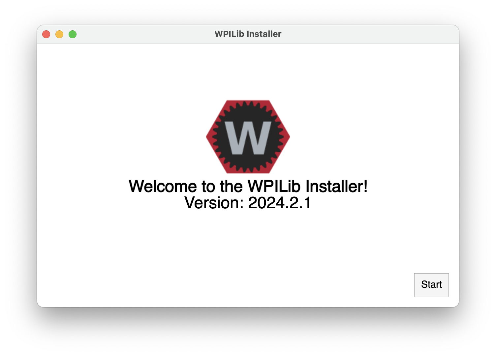
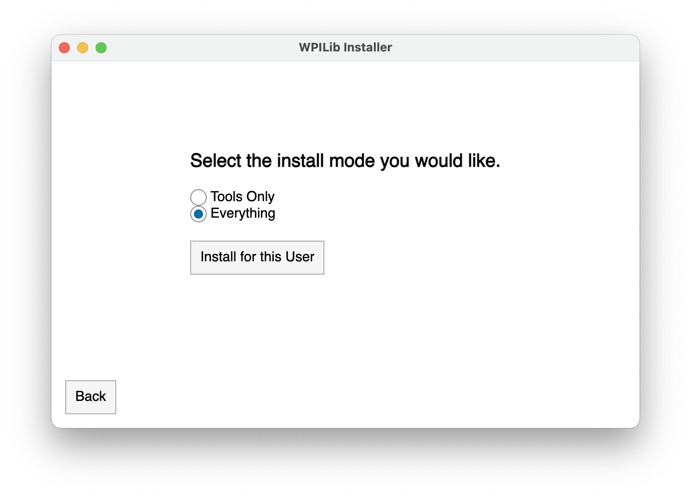
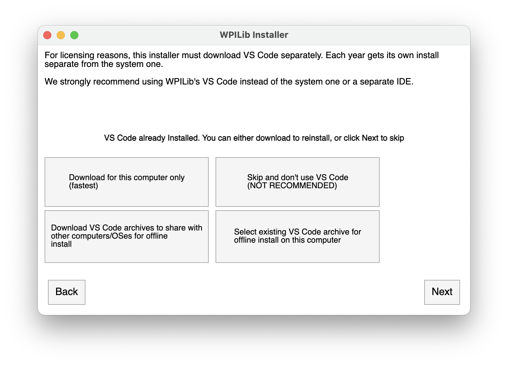
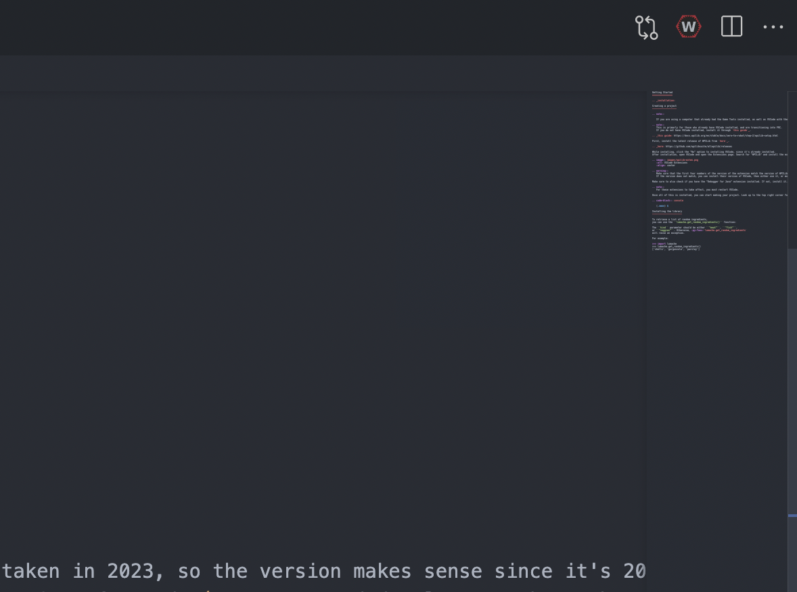
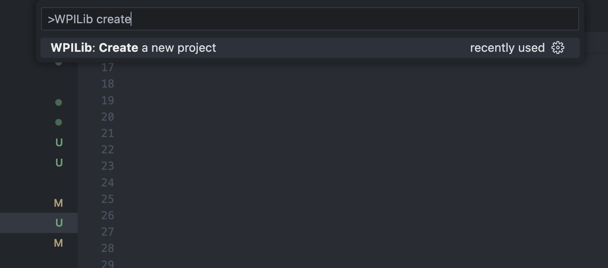
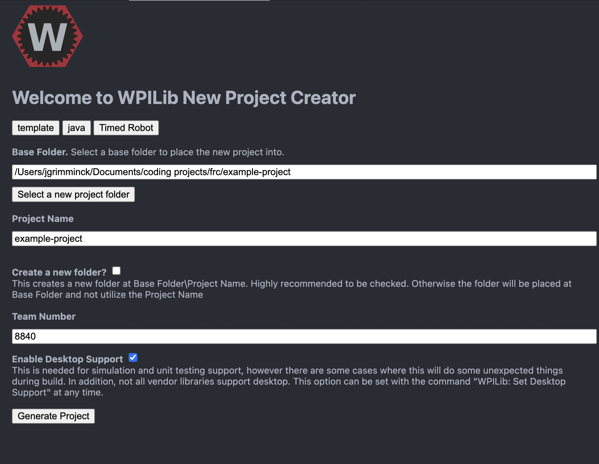
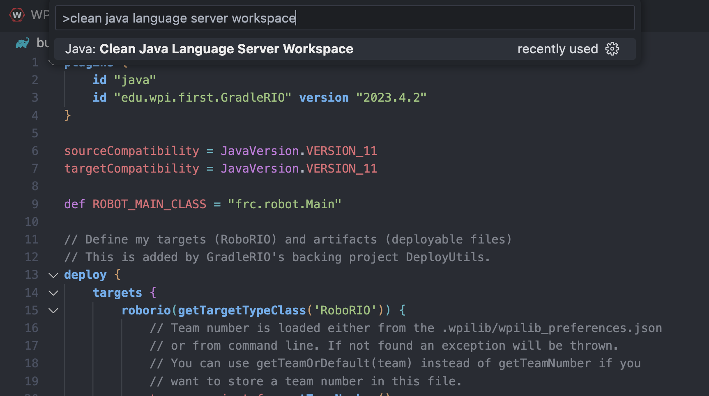

Getting Started
===============

.. _installation:

Installing WPILib
------------------

.. note::

   If you are using a computer that already has the JDK, VSCode, the WPILib Extension for VSCode, and the WPILib itself installed, you can skip this step.

First, download the latest release of WPILib from `their Github page`_.

.. _their Github page: https://github.com/wpilibsuite/allwpilib/releases

After the download completes, find the downloaded installer file (on MacOS this is a file with .dmg file extension, most likely located in your Downloads folder), open it, and launch (double-click) the WPILibInstaller filer. Click "Yes" to start the installation, and then with "Everything" selected, click "Install for this User". Then click "Next" on the screens that follow to use all of the defaults and complete the installation. 

.. note::
   Even if you already have a JDK installed on your machine, installing WPILib will put a new copy of the JDK on your machine. This is OK, and makes everything easier because it's the right JDK version and won't interfere with any other projects you might have.

.. note::
   Even if you already have VSCode installed on your machine, the WPILib install will install another version of VSCode, because this is the easiest way to get the WPILib Extension installed properly in VSCode. For some reason, it doesn't seem to work to install it through the VSCode Extensions Markeplace. This is also nice because it won't mess up your main version of VSCode.

After the installation completes, find a folder in your home directory called "wpilib" (you can use Finder on MacOS), open it, then open a folder inside called "2024", and a folder inside that called "vscode", and then launch the "VSCode" application inside that folder (by double-clicking). VSCode should now launch on your device.

With VSCode open, open the Explorer in the left sidebar (where you can see the folders and files of the project). Open a directory called ".vscode" and then open a file inside called "settings.json". Add the following new line so that you code will format automatically when you save files:

.. code-block:: json
    :linenos:

   {
      // add this line at the top
      "editor.formatOnSave": true,
      // existing settings
   }

Make sure to also check if you have the "Debugger for Java" VSCode Extension installed. If not, install it. You may have to restart VSCode for new extensions to take effect (but generally not in the latest versions of VSCode.

.. note::
   If you are using a Mac, you may need to install the Command Line Tools for Xcode. To do this, run :code:`xcode-select --install` in the terminal.

Once all of this is installed, you can start making your project. 

.. _Creating a new project:

Creating a new project
----------------------

Look up to the top right corner for a hexagon with a "W" in it.

Click it, and type in "create," then click "WPILib: Create a new project."

Once done, you should have a new tab open on VSCode that looks like a form, with a title of "Welcome to WPILib New Project Creator." Fill it out as follows.

"Select a project type" button: This will open a dropdown menu. Select "Template," then "java," then "Timed Robot."

"Base Folder": Click "Select a new project folder" and select the wpilib/2024 folder that you found vscode in.

"Project Name" Create a new name for the project folder, like "test-project", it will be created in the base folder.

Type in your team number. For example, our team number is 8840, so we would type in 8840. If you are not part of Bay Robotics, your number will be different.

Select the option that says "Enable desktop support," then click "Generate Project."

You can select whether you want to open it in that window or a new one.

Once done, the project will open and start building in the terminal screen at the bottom.
This may fail, and that's OK. We'll be making a few changes to fix this.

Open the `build.gradle` file in the root of the project.
At the top, make sure the version of :code:`edu.wpi.first.GradleRIO` is set to :code:`2024.2.1`), and change/save if necessary.

After, open the terminal again and run 

.. code-block:: console

   $ ./gradlew build

The build should now be successful. If not, press the WPILib button on the top right of VSCode and search for :code:`>Java: Clean Java Language Server Workspace`.

Follow through any steps that appear. If it still doesn't work, try restarting VSCode, or ask on the Unofficial First Robotics Discord server, found here: https://discord.gg/frc.

.. warning::
   In the future, the failure to build may come up again, OR the build.gradle file has an error. If this happens, try the above steps to fix the issue.

Everything should be setup now!

Installing the library
----------------------

Open terminal in the project, either in VSCode or elsewhere, then run:

.. code-block:: console

   $ bash <(curl -s https://raw.githubusercontent.com/frc8840/8840-utils/main/setup.sh)

In the instructions, it will prompt you whether you want to edit `build.gradle` and run :code:`./gradlew build`. Type "y" for both then press enter in order to run it.

.. note::
   If this is your second time running it, answer "n" to editing `build.gradle`!

If the build fails, try running :code:`>Java: Clean Java Language Server Workspace`, then run :code:`./gradlew build` manually.

Everything is ready to start using :code:`8840-utils`!

.. note::
   Don't know where to get started? Try looking at our example tutorial, found :ref:`here<example-project>`!
