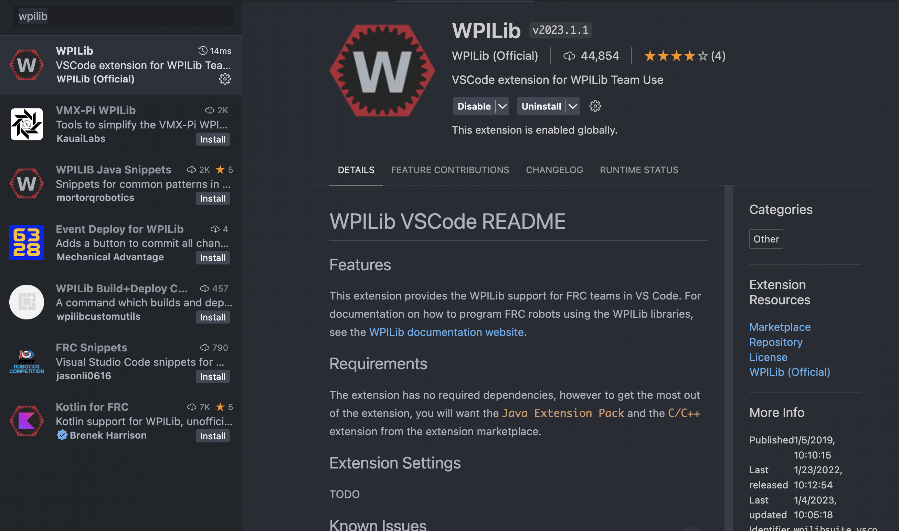

Getting Started
===============

.. _installation:

Creating a project
------------------

.. note::

   If you are using a computer that already had the Game Tools installed, as well as VSCode with the latest FRC extensions, you can skip this step.

.. note::
   This is primarly for those who already have VSCode installed, and are transitioning into FRC. 
   If you do not have VSCode installed, install it through `this guide`_ instead, then move to :ref:`Creating a new project`.

.. _this guide: https://docs.wpilib.org/en/stable/docs/zero-to-robot/step-2/wpilib-setup.html

First, install the latest release of WPILib from `here`_.

.. _here: https://github.com/wpilibsuite/allwpilib/releases

While installing, click the "No" option to installing VSCode, since it's already installed. 
After installation, open VSCode and open the Extensions page. Search for "WPILib" and install the extension.

.. warning::
   Make sure that the first four numbers of the version of the extension match the version of WPILib you installed. The above image was taken in 2023, so the version makes sense since it's 2023. 
   If the version does not match, you can install their version of VSCode, then either use it, or move the extensions manually to your version of VSCode (not recommended unless you know what you're doing).

Make sure to also check if you have the "Debugger for Java" extension installed. If not, install it.

.. note::
   For these extensions to take affect, you must restart VSCode.

Once all of this is installed, you can start making your project. 

.. _Creating a new project:

Creating a new project
----------------------

Look up to the top right corner for a hexagon with a "W" in it.

.. image:: images/wpilib-corner.png
   :alt: WPILib Corner
   :align: center

Click it, and type in "create," then click "WPILib: Create a new project."

Once done, you should have a new tab open on VSCode that looks like a form, with a title of "Welcome to WPILib New Project Creator."
First, click on the "Select project type" button. This will open a dropdown menu. Select "Template," then "java," then "Timed Robot."

Select a new project folder - we recommend creating a new folder, then creating the project in it since the extension is always a little buggy.

Create a new name for the project, we recommend setting it to the same name as the new folder.

If you created a new folder, deselect the "Create a new folder?" option.

Type in your team number. For example, our team number is 8840, so we would type in 8840. If you are not part of Bay Robotics, your number will be different.

Select the option that says "Enable desktop support," then click "Generate Project."

You can select whether you want to open it in that window or a new one.

Once done, the project will open and start building in the terminal screen at the bottom.
This may fail, and that's OK. We'll be making a few changes to fix this.

First, open the `gradle` folder, then open the `wrapper` folder. Open the `gradle-wrapper.properties` file. 
Change the :code:`distribution-url` to :code:`https\://services.gradle.org/distributions/gradle-7.6-bin.zip`.

Save the file, and close it. Open the `build.gradle` file in the root of the project.
At the top, change the version of :code:`edu.wpi.first.GradleRIO` to whatever version of WPILib you installed (for example: :code:`2023.4.2`), then save it.

Open settings with `Ctrl + ,` or `Cmd + ,` (Control/Command + Comma) and search for :code:`java.import.gradle.java.home`, and set it to a Java 11 or 17 JDK (that's what we've found works best), IF YOU HAVE JAVA INSTALLED ALREADY. 
It should automatically fill it in for you (hopefully).

.. note::
   If you haven't installed a Temurin JDK yet, press the WPILib button in the top right of VSCode and search for :code:`>Java: Install New JDK` instead of whatever is in the search bar.
   Install the 17 (LTS) version. Once down, do the above step.

After, open the terminal again and run 

.. code-block:: console

   $ ./gradlew build

The build should now be successful. If not, press the WPILib button on the top right of VSCode and search for :code:`>Java: Clean Java Language Server Workspace`.

Follow through any steps that appear. If it still doesn't work, try restarting VSCode, or ask on the Unofficial First Robotics Discord server, found here: https://discord.gg/frc.

.. note::
   If you are using a Mac, you may need to install the Command Line Tools for Xcode. To do this, run :code:`xcode-select --install` in the terminal.

.. warning::
   In the future, the failure to build may come up again, OR the build.gradle file has an error. If this happens, try the above steps to fix the issue.

Everything should be setup now!

Installing the library
----------------------

Open terminal in the project, either in VSCode or elsewhere, then run:

.. code-block:: console

   $ bash <(curl -s https://raw.githubusercontent.com/frc8840/8840-utils/main/setup.sh)

In the instructions, it will prompt you whether you want to edit `build.gradle` and run :code:`./gradlew build`. Type "y" for both then press enter in order to run it.

.. note::
   If this is your second time running it, answer "n" to editing `build.gradle`!

If the build fails, try running :code:`>Java: Clean Java Language Server Workspace`, then run :code:`./gradlew build` manually.

Everything is ready to start using 8840-utils!

.. note::
   Don't know where to get started? Try looking at our example tutorial, found :ref:`here<example-project>`!
